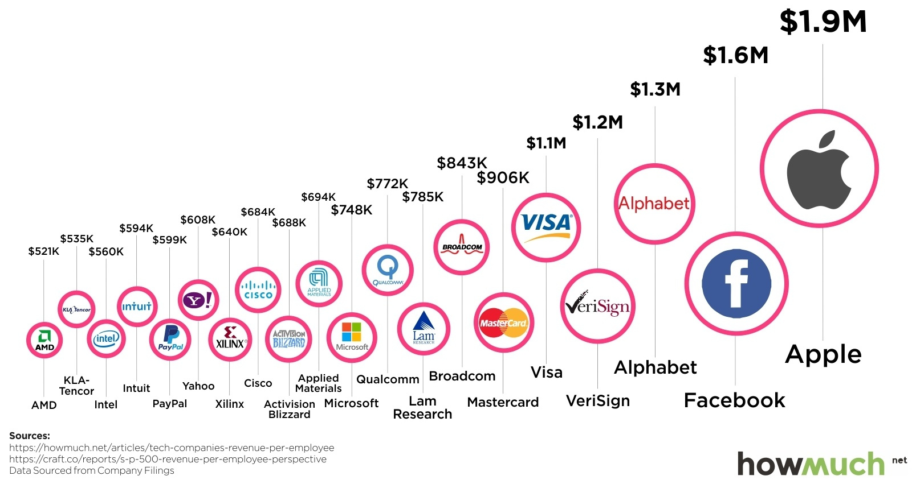

[comment]: # (THEME = black)
[comment]: # (CODE_THEME = base16/zenburn)

# My Career (so far)

And the Software Industry's focus on leveraged value

Note:
* Quinten and Maggie asked me here to give some industry perspective
* Thanks very much for the time and space
* Let's get into a few things I've worked on

[comment]: # (!!!)

# Bio
* Backend developer at a company selling packaged software (analytics)
* Fullstack and platform developer in the P&C insurance industry
* Reliability & operations engineer within financial services

[comment]: # (!!!)

# Themes
* Design your career
* Roles rarely fit neatly into the job archetypes
* Deliver outcomes, not code

Note:
* Careers don't have to be fluid
* median tenure is 16-24 months

* Code leverages us by encoding our decisions, lowering latency, and increasing throughput. Code is not special, any system that can do that is valuable.

[comment]: # (!!!)
Backend developer / Packaged software

| Insights | Hindrances |
|--------|-----------------|
| very focused on the process of building software| Very removed from value|
| exposure to mulitple industries/verticals | very removed from operations |

Notes:
* Hired to support build systems
* Moved to Query/Reporting, then down stack to platform

[comment]: # (!!!)
Platform / Insurance

| Insights | Hindrances |
|----------|---------------|
| See how uniqely each industry scores competitors| Not a wide support matrix |
| How to manage constrained talent supply | working with constrained talent   |

Note:
* Platforms and DX is hugely important when working with BAs converted to devs
* Industries were convinced they could convert BAs to devs in 2018.
* The value was encoding the decisions. Anyone can learn to program
    * DSLs, low-code, Appian/Guidewire, well before LLMs

[comment]: # (!!!)

Reliability & Scale in the finance industry

Notes:
* Ethics & compliance are just as important as hard skills
* transition to what industry expects

[comment]: # (!!!)

### Myths and misunderstandings

[comment]: # (!!! data-auto-animate)

### Myths and misunderstandings

- I want a job that hires me to just code

Notes:
* The "just code" is narrow tasks from seniors

[comment]: # (!!! data-auto-animate)

### Myths and misunderstandings

- I want a job that hires me to just code
- I want to be just a FE/BE/data person

Notes:
* It's always been full stack; j2ee deploys + DB2

[comment]: # (!!! data-auto-animate)

### Myths and misunderstandings

- I want a job that hires me to just code
- I want to be just a FE/BE/data person
- (pretty much any office perk)

Notes:
* The disappear
* cheap differentiation when competition is tough

[comment]: # (!!! data-auto-animate)

# Leverage

Notes:
* exchange capital for forward revenue with minimal ongoing cost

[comment]: # (!!!)

| Industry | Revenue per employee |
|----------|---------------|
| Entertainment | $283,555.80 |
| Insurance (General) | $213,061.80 |
| Retail (Grocery) | $114,049.04 |
| Software (internet) | $148,811.01 | 
| Brokerage & Investment Banking | $3,401,397.82 | 

[comment]: # (!!!)

 
[comment]: # (!!!)

# Chasing trends (a bit late)

[comment]: # (!!!)
# Career hype cycles 

[comment]: # (!!!)`

# More insight with less overhead

[comment]: # (!!!)

# More insight with less overhead

[comment]: # (!!!)

# More insight with less overhead

[comment]: # (!!!)

# More insight with less overhead

[comment]: # (!!!)

# More insight with less overhead