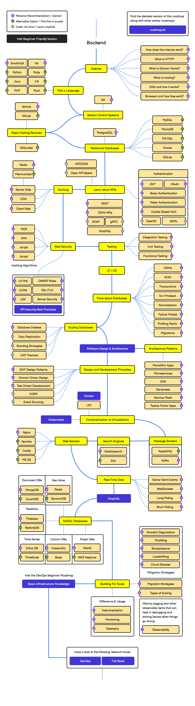
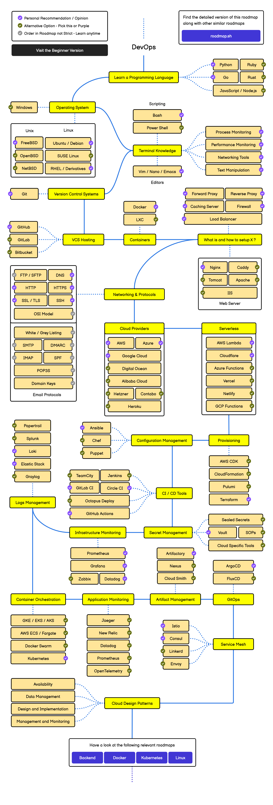

[comment]: # (THEME = black)
[comment]: # (CODE_THEME = base16/zenburn)

# I've never been paid to code
A few of my industry misconceptions

Note:
* Quinten and Maggie asked me here to give some industry perspective
* Thanks very much for the time and space
* Let's get into a few things I've worked on

[comment]: # (!!!)

# Bio
* Backend developer at a company selling packaged software (analytics)
* Fullstack and platform developer in the P&C insurance industry
* Reliability & operations engineer within financial services

[comment]: # (!!!)

# Themes
* Design your career
* Roles rarely fit neatly into the job archetypes
* Deliver outcomes, not code

Note:
* Careers don't have to be fluid
* median tenure is 16-24 months

* Code leverages us by encoding our decisions, lowering latency, and increasing throughput. Code is not special, any system that can do that is valuable.

[comment]: # (!!!)

| Insights | Hindrances |
|--------|-----------------|
| very focused on the process of building software| Very removed from value|
| exposure to mulitple industries/verticals | very removed from operations |
| See how uniqely each industry scores competitors| Not a wide support matrix |
| How to manage constrained talent supply | working with constrained talent   |

Notes:
* Platforms and DX is hugely important when working with BAs converted to devs
* Industries were convinced they could convert BAs to devs in 2018.
* The value was encoding the decisions. Anyone can learn to program
    * DSLs, low-code, Appian/Guidewire, well before LLMs

[comment]: # (!!! data-auto-animate)

### Myths and misunderstandings

- I want a job that hires me to just code
- I want to be just a FE/BE/data person
- (pretty much any office perk)

Notes:
* They disappear
* cheap differentiation when competition is tough

[comment]: # (!!!)
# Leverage

| Industry | Revenue per employee |
|----------|---------------|
| Entertainment | $283,555.80 |
| Insurance (General) | $213,061.80 |
| Retail (Grocery) | $114,049.04 |
| Software (internet) | $148,811.01 | 
| Restaurant/Dining | $32,100.95 | 

<small>
source: https://pages.stern.nyu.edu/~adamodar/New_Home_Page/datafile/Employee.html
</small>

Notes:
* exchange capital for forward revenue with minimal ongoing cost
* Get more revenue
* Reduce costs
* Operate larger fleets of compute/storage

[comment]: # (!!!)

 

Notes: 
* companies run code written a decade ago
* working across industries
* increasing in-industry leverage
* Moving on is a different career model than in-industry folks

[comment]: # (!!!)

<small>
source: https://github.com/kamranahmedse/developer-roadmap/tree/master/public/pdfs/roadmaps
</small>

  

